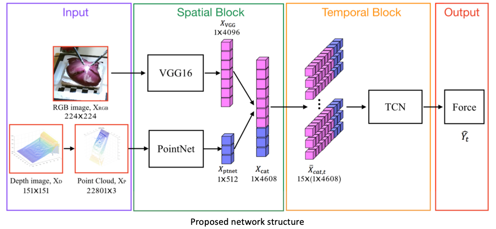

# Learning-to-See-Forces
[Project](http://www.cs.jhu.edu/~gaoc/learningtoseeforces.html) | [Paper](https://arxiv.org/pdf/1808.00057.pdf) | 
[Slide](http://www.cs.jhu.edu/~gaoc/files/CARE2018_Learning_to_See_Forces.pdf)

Pytorch implementation of surgical force prediction using da Vinci robot. **This paper is awarded [Best Paper Award (second place)](http://www.cs.jhu.edu/~gaoc/images/care_bestpaper.jpg).**


Learning to See Forces: Surgical Force Prediction with RGB-Point Cloud Temporal Convolutional Networks  
[Cong Gao](http://www.cs.jhu.edu/~gaoc/), [Xingtong Liu](http://www.cs.jhu.edu/~xingtongl/), [Michael Peven](https://malonecenter.jhu.edu/people/students/#), [Mathias Unberath](https://mathiasunberath.github.io/), and [Austin Reiter](https://www.cs.jhu.edu/~areiter/JHU/Home.html)   
*Computer Assisted and Robotic Endoscopy, MICCAI workshop 2018.*

Obtaining haptic feedback is one of the major limitations during robot assisted surgical procedures. We propose the use of “visual cues” to infer forces from tissue deformation. Endoscopic video is a passive sensor that is freely available, in the sense that any minimally-invasive procedure already utilizes it. To this end, we employ deep learning to infer forces from video as an attractive low-cost and accurate alterna- tive to typically complex and expensive hardware solutions.



## Setup

### Prerequisites
- Linux or OSX
- NVIDIA GPU + CUDA

### Getting Started
- Install pytorch and dependencies from https://pytorch.org/
- Clone this repo:
```bash
git clone https://github.com/gaocong13/Learning-to-See-Forces.git
cd Learning-to-See-Forces/src
```
- Extract PointNet feature and VGG16 feature from last layers:
```bash
python extract_ptnet_feature.py
python extract_vgg_feature.py
```
- Train the model
```bash
mkdir ../model ../result
python trainTCN_main.py
```

## Datasets
An example dataset is provided (./data/). It contains RGB image data (./data/rgbimage1-1), depth image data (./data/depthimage1-1) and measured grountruth force (./data/Force_ori). All are sorted and synchronized accordingly. Please contact [cgao11@jhu.edu](cgao11@jhu.edu) if you want to use the full dataset.

## Models
PointNet pretrained model is uploaded (./data/pt_net_00041.pt). Please contact [cgao11@jhu.edu](cgao11@jhu.edu) if you want to use the full extracted features and final TCN model.

## Citation
If you use this code for your research, please cite our paper <a href="https://arxiv.org/pdf/1808.00057.pdf">Learning to See Forces: Surgical Force Prediction with RGB-Point Cloud Temporal Convolutional Networks </a>:

```
@incollection{gao2018learning,
title={Learning to See Forces: Surgical Force Prediction with RGB-Point Cloud Temporal Convolutional Networks},
author={Gao, Cong and Liu, Xingtong and Peven, Michael and Unberath, Mathias and Reiter, Austin},
booktitle={OR 2.0 Context-Aware Operating Theaters, Computer Assisted Robotic Endoscopy, Clinical Image-Based Procedures, and Skin Image Analysis},
pages={118--127},
year={2018},
publisher={Springer}
}
```

## Acknowledgments
This work was funded by an Intuitive Surgical Sponsored Research Agreement.
